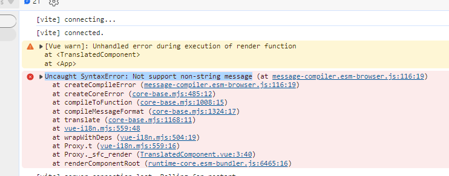

# reproduction-vue-i18n-blocks-error

This is a reproduction project showing an error when trying to use vue-i18n in combination with [i18n blocks in single file components](https://vue-i18n.intlify.dev/guide/advanced/sfc.html#single-file-components) and the Vue `<script setup>` style of writing components.

## Start and observe error

1. Run `npm ci`
2. Run `npm run dev`
3. In a browser navigate to started development application (usually http://localhost:5173/)
4. Open browser DevTools
6. Refresh the page
7. Observe console error: "Uncaught SyntaxError: Not support non-string message"

